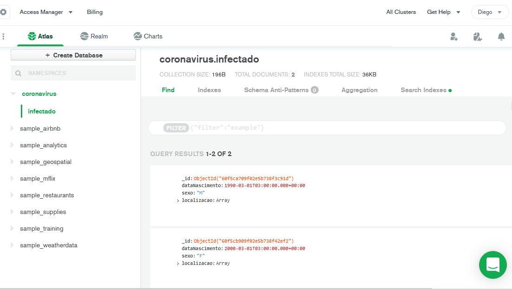

# api-dio
<p align="center">
    
  </p>


<h3 align="center">
  Foi desenvolvida uma API.NET core usando Visual Studio Code referente ao Bootcamp da DIO / Take Blip. com o objetivo demonstrar a integração com um cluster MongoDB.  Aplicação deve fazer o cadastro de infectados com Coronavírus, gravando no banco de dados a data de nascimento, o sexo e localização das pessoas. Aula orientada pelo professor Gabriel Faraday.
</h3>


<p align="center">
  <a href="#funcionalidades">Funcionalidades</a>&nbsp;&nbsp;&nbsp;|&nbsp;&nbsp;&nbsp;
  <a href="#heavy_check_mark-configurações-necessárias">Configurações necessárias</a>&nbsp;&nbsp;&nbsp;|&nbsp;&nbsp;&nbsp;
  <a href="#arrow_down_small-clonando-o-repositório">Clonando o repositório</a>&nbsp;&nbsp;&nbsp;|&nbsp;&nbsp;&nbsp;
  <a href="#beginner-iniciando-a-aplicação">Iniciando a aplicação</a>&nbsp;&nbsp;&nbsp;|&nbsp;&nbsp;&nbsp;
  <a href="#wrench-tecnologias--ferramentas--recursos">Tecnologias | Ferramentas | Recursos</a>&nbsp;&nbsp;&nbsp;|&nbsp;&nbsp;&nbsp;
  <a href="#memo-license">Licença</a>
</p>

Durante as aulas do [Bootcamp take Blip da DIO](https://digitalinnovation.one/) com o professor Gabriel Faraday, foram aprendidos conteúdos relacionados a criação do projeto com integração e persistência no MongoDB.

### Funcionalidades

- Cadastrar pessoas;
- Visualiazar pessoas cadastradas;


### :heavy_check_mark: Configurações necessárias

Seguem as configurações necessárias para visualizar a aplicação em sua máquina.

-  [Vs Code](https://code.visualstudio.com/download);
-  [NET core - Versão 5.0.302](https://dotnet.microsoft.com/download);
-  Ambiente console application para sistema operacional Windows;
-  [MongoDB Atlas](https://www.mongodb.com/cloud/atlas/register);
-  [Postman](https://www.postman.com/downloads/);.

### :arrow_down_small: Clonando o repositório
1. Pelo terminal, acesse o diretório em que deseja ter o repositório clonado e execute o comando a seguir.
```bash
# clonando o repositório
git clone https://github.com/Diegototi/api-dio.git
```

### :beginner: Iniciando a aplicação
1. É preciso configurar o acesso ao banco no appsettings. Após rodar a aplicação iniciar os testes com o Postman de POST e GET
Para teste:

https://localhost:5001/infectado

Exemplo de dados para cadastro:
<br>{</br>
	"dataNascimento": "1993-03-01",<br>
	"sexo": "F",</br>
	"latitude": -23.5630994,
	"longitude": -46.6565712<br>
} </br>


### :wrench: Tecnologias | Ferramentas | Recursos

Esse projeto foi desenvolvido utilizando os seguintes recursos:

-  [Vs Code](https://code.visualstudio.com/download);
-  [NET core - Versão 5.0.302](https://dotnet.microsoft.com/download);
-  [MongoDB Atlas](https://www.mongodb.com/cloud/atlas/register);


### :memo: License
Esse projeto está sob MIT license. Veja [LICENSE](https://github.com/Diegototi/series-console-app/blob/main/LICENSE) para mais informações.

---

Feito por Diego Almeida :blue_heart: Contato: https://www.linkedin.com/in/diego-almeida-a8394a215/ :blush:
